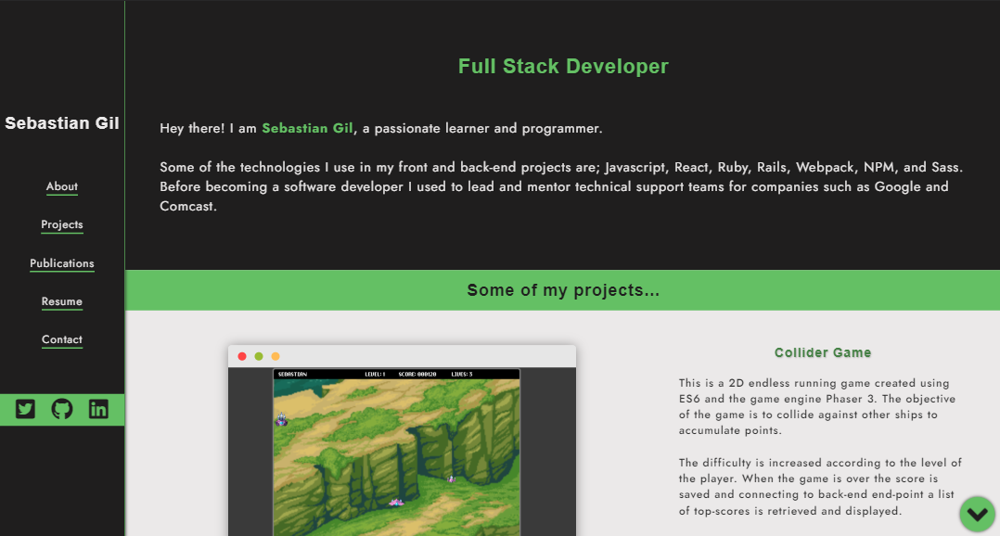

# Sebastian Gil Rodriguez - Portfolio

This is my web portfolio, where you will have access to some of my projects, my resume, contact info, and social media profiles.

## Live Version

[sebgil.me](https://sebgil.me)

## Future Changes

- Use webpack for bundling the website files.
- Add in-and-out JS animations for projects.
- Dynamically create each project/article entry instead of hard coding it.

## Screenshot

👤 **Sebastian Gil Rodriguez**

- Github: [@sebGilR](https://github.com/sebGilR)
- Twitter: [@sebGilR](https://twitter.com/sebGilR)
- Linkedin: [sebastiangilrodriguez](https://www.linkedin.com/in/sebastiangilrodriguez)

## Show your support

Give a ⭐️ if you like this project!
